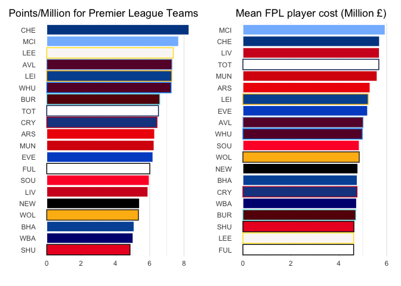

```r
library(tidyverse)     # for data cleaning and plotting
library(gardenR)       # for Lisa's garden data
library(lubridate)     # for date manipulation
library(openintro)     # for the abbr2state() function
library(palmerpenguins)# for Palmer penguin data
library(maps)          # for map data
library(ggmap)         # for mapping points on maps
library(gplots)        # for col2hex() function
library(RColorBrewer)  # for color palettes
library(sf)            # for working with spatial data
library(leaflet)       # for highly customizable mapping
library(ggthemes)      # for more themes (including theme_map())
library(plotly)        # for the ggplotly() - basic interactivity
library(gganimate)     # for adding animation layers to ggplots
library(gifski)        # for creating the gif (don't need to load this library every time,but need it installed)
library(transformr)    # for "tweening" (gganimate)
library(shiny)         # for creating interactive apps
library(patchwork)     # for nicely combining ggplot2 graphs  
library(gt)            # for creating nice tables
library(rvest)         # for scraping data
library(robotstxt)     # for checking if you can scrape data
library(readxl)
theme_set(theme_minimal())
```


```r
# Lisa's garden data
data("garden_harvest")

#COVID-19 data from the New York Times
covid19 <- read_csv("https://raw.githubusercontent.com/nytimes/covid-19-data/master/us-states.csv")
```

## Put your homework on GitHub!

Go [here](https://github.com/llendway/github_for_collaboration/blob/master/github_for_collaboration.md) or to previous homework to remind yourself how to get set up. 

Once your repository is created, you should always open your **project** rather than just opening an .Rmd file. You can do that by either clicking on the .Rproj file in your repository folder on your computer. Or, by going to the upper right hand corner in R Studio and clicking the arrow next to where it says Project: (None). You should see your project come up in that list if you've used it recently. You could also go to File --> Open Project and navigate to your .Rproj file. 

## Instructions

* Put your name at the top of the document. 

* **For ALL graphs, you should include appropriate labels.** 

* Feel free to change the default theme, which I currently have set to `theme_minimal()`. 

* Use good coding practice. Read the short sections on good code with [pipes](https://style.tidyverse.org/pipes.html) and [ggplot2](https://style.tidyverse.org/ggplot2.html). **This is part of your grade!**

* **NEW!!** With animated graphs, add `eval=FALSE` to the code chunk that creates the animation and saves it using `anim_save()`. Add another code chunk to reread the gif back into the file. See the [tutorial](https://animation-and-interactivity-in-r.netlify.app/) for help. 

* When you are finished with ALL the exercises, uncomment the options at the top so your document looks nicer. Don't do it before then, or else you might miss some important warnings and messages.

## Your first `shiny` app 

  1. This app will also use the COVID data. Make sure you load that data and all the libraries you need in the `app.R` file you create. Below, you will post a link to the app that you publish on shinyapps.io. You will create an app to compare states' cumulative number of COVID cases over time. The x-axis will be number of days since 20+ cases and the y-axis will be cumulative cases on the log scale (`scale_y_log10()`). We use number of days since 20+ cases on the x-axis so we can make better comparisons of the curve trajectories. You will have an input box where the user can choose which states to compare (`selectInput()`) and have a submit button to click once the user has chosen all states they're interested in comparing. The graph should display a different line for each state, with labels either on the graph or in a legend. Color can be used if needed. 
  
  [Covid-19 Trends]("https://alexhopkins.shinyapps.io/Covid-19-Trends/")
  
## Warm-up exercises from tutorial

  2. Read in the fake garden harvest data. Find the data [here](https://github.com/llendway/scraping_etc/blob/main/2020_harvest.csv) and click on the `Raw` button to get a direct link to the data. 
  

```r
fake_garden_harvest <- read_csv("https://raw.githubusercontent.com/llendway/scraping_etc/main/2020_harvest.csv", 
    col_types = cols(weight = col_number()), 
    na = "MISSING", skip = 2) %>% 
  select(-X1)
```
  
  
  3. Read in this [data](https://www.kaggle.com/heeraldedhia/groceries-dataset) from the kaggle website. You will need to download the data first. Save it to your project/repo folder. Do some quick checks of the data to assure it has been read in appropriately.
  

```r
groceries <- read_csv("Groceries_dataset.csv")

groceries %>% 
  mutate(across(where(is.character), as.factor)) %>% 
  summary()
```

```
##  Member_number          Date               itemDescription 
##  Min.   :1000   21-01-2015:   96   whole milk      : 2502  
##  1st Qu.:2002   21-07-2015:   93   other vegetables: 1898  
##  Median :3005   08-08-2015:   92   rolls/buns      : 1716  
##  Mean   :3004   29-11-2015:   92   soda            : 1514  
##  3rd Qu.:4007   30-04-2015:   91   yogurt          : 1334  
##  Max.   :5000   26-03-2015:   88   root vegetables : 1071  
##                 (Other)   :38213   (Other)         :28730
```

  4. CHALLENGE(not graded): Write code to replicate the table shown below (open the .html file to see it) created from the `garden_harvest` data as best as you can. When you get to coloring the cells, I used the following line of code for the `colors` argument:
  

```r
jul_colors = scales::col_numeric(
      palette = paletteer::paletteer_d(
        palette = "RColorBrewer::YlGn") %>% 
  as.character(),
  domain = c(0.1, 13))

aug_colors = scales::col_numeric(
      palette = paletteer::paletteer_d(
        palette = "RColorBrewer::YlGn") %>% 
  as.character(),
  domain = c(0.1, 32))

sep_colors = scales::col_numeric(
      palette = paletteer::paletteer_d(
        palette = "RColorBrewer::YlGn") %>% 
  as.character(),
  domain = c(0.1, 28))

oct_colors = scales::col_numeric(
      palette = paletteer::paletteer_d(
        palette = "RColorBrewer::YlGn") %>% 
  as.character(),
  domain = c(0.1, 12))
```


```r
garden_harvest %>% 
  mutate(month = month(date, label = TRUE)) %>% 
  filter(vegetable %in% c("beans", "carrots", "tomatoes")) %>% 
  group_by(vegetable, variety, month) %>% 
  summarise(weight_lbs = sum(weight)*0.00220462) %>% 
  pivot_wider(id_cols = vegetable:weight_lbs,
              names_from = "month",
              values_from = "weight_lbs") %>% 
  replace_na(list(Jul = 0, Aug = 0, Sep = 0, Oct = 0)) %>% 
  gt(rowname_col = "variety",
    groupname_col = "vegetable") %>% 
  tab_header(
    title = "Bean, Carrot, and Tomato Harvest (lb)") %>%
  fmt_number(columns = c("Jul", "Aug", "Sep", "Oct"),
             decimals = 2) %>%
  summary_rows(
    groups = TRUE,
    columns = c("Jul", "Aug", "Sep", "Oct"),
    fns = list(sum = "sum"),
    formatter = fmt_number,
    decimals = 1) %>% 
  data_color(columns = vars(Jul),
             colors = jul_colors) %>% 
  data_color(columns = vars(Aug),
             colors = aug_colors) %>% 
  data_color(columns = vars(Sep),
             colors = sep_colors) %>% 
  data_color(columns = vars(Oct),
             colors = oct_colors)
```

```{=html}
<style>html {
  font-family: -apple-system, BlinkMacSystemFont, 'Segoe UI', Roboto, Oxygen, Ubuntu, Cantarell, 'Helvetica Neue', 'Fira Sans', 'Droid Sans', Arial, sans-serif;
}

#kdwyzcfhsm .gt_table {
  display: table;
  border-collapse: collapse;
  margin-left: auto;
  margin-right: auto;
  color: #333333;
  font-size: 16px;
  font-weight: normal;
  font-style: normal;
  background-color: #FFFFFF;
  width: auto;
  border-top-style: solid;
  border-top-width: 2px;
  border-top-color: #A8A8A8;
  border-right-style: none;
  border-right-width: 2px;
  border-right-color: #D3D3D3;
  border-bottom-style: solid;
  border-bottom-width: 2px;
  border-bottom-color: #A8A8A8;
  border-left-style: none;
  border-left-width: 2px;
  border-left-color: #D3D3D3;
}

#kdwyzcfhsm .gt_heading {
  background-color: #FFFFFF;
  text-align: center;
  border-bottom-color: #FFFFFF;
  border-left-style: none;
  border-left-width: 1px;
  border-left-color: #D3D3D3;
  border-right-style: none;
  border-right-width: 1px;
  border-right-color: #D3D3D3;
}

#kdwyzcfhsm .gt_title {
  color: #333333;
  font-size: 125%;
  font-weight: initial;
  padding-top: 4px;
  padding-bottom: 4px;
  border-bottom-color: #FFFFFF;
  border-bottom-width: 0;
}

#kdwyzcfhsm .gt_subtitle {
  color: #333333;
  font-size: 85%;
  font-weight: initial;
  padding-top: 0;
  padding-bottom: 4px;
  border-top-color: #FFFFFF;
  border-top-width: 0;
}

#kdwyzcfhsm .gt_bottom_border {
  border-bottom-style: solid;
  border-bottom-width: 2px;
  border-bottom-color: #D3D3D3;
}

#kdwyzcfhsm .gt_col_headings {
  border-top-style: solid;
  border-top-width: 2px;
  border-top-color: #D3D3D3;
  border-bottom-style: solid;
  border-bottom-width: 2px;
  border-bottom-color: #D3D3D3;
  border-left-style: none;
  border-left-width: 1px;
  border-left-color: #D3D3D3;
  border-right-style: none;
  border-right-width: 1px;
  border-right-color: #D3D3D3;
}

#kdwyzcfhsm .gt_col_heading {
  color: #333333;
  background-color: #FFFFFF;
  font-size: 100%;
  font-weight: normal;
  text-transform: inherit;
  border-left-style: none;
  border-left-width: 1px;
  border-left-color: #D3D3D3;
  border-right-style: none;
  border-right-width: 1px;
  border-right-color: #D3D3D3;
  vertical-align: bottom;
  padding-top: 5px;
  padding-bottom: 6px;
  padding-left: 5px;
  padding-right: 5px;
  overflow-x: hidden;
}

#kdwyzcfhsm .gt_column_spanner_outer {
  color: #333333;
  background-color: #FFFFFF;
  font-size: 100%;
  font-weight: normal;
  text-transform: inherit;
  padding-top: 0;
  padding-bottom: 0;
  padding-left: 4px;
  padding-right: 4px;
}

#kdwyzcfhsm .gt_column_spanner_outer:first-child {
  padding-left: 0;
}

#kdwyzcfhsm .gt_column_spanner_outer:last-child {
  padding-right: 0;
}

#kdwyzcfhsm .gt_column_spanner {
  border-bottom-style: solid;
  border-bottom-width: 2px;
  border-bottom-color: #D3D3D3;
  vertical-align: bottom;
  padding-top: 5px;
  padding-bottom: 6px;
  overflow-x: hidden;
  display: inline-block;
  width: 100%;
}

#kdwyzcfhsm .gt_group_heading {
  padding: 8px;
  color: #333333;
  background-color: #FFFFFF;
  font-size: 100%;
  font-weight: initial;
  text-transform: inherit;
  border-top-style: solid;
  border-top-width: 2px;
  border-top-color: #D3D3D3;
  border-bottom-style: solid;
  border-bottom-width: 2px;
  border-bottom-color: #D3D3D3;
  border-left-style: none;
  border-left-width: 1px;
  border-left-color: #D3D3D3;
  border-right-style: none;
  border-right-width: 1px;
  border-right-color: #D3D3D3;
  vertical-align: middle;
}

#kdwyzcfhsm .gt_empty_group_heading {
  padding: 0.5px;
  color: #333333;
  background-color: #FFFFFF;
  font-size: 100%;
  font-weight: initial;
  border-top-style: solid;
  border-top-width: 2px;
  border-top-color: #D3D3D3;
  border-bottom-style: solid;
  border-bottom-width: 2px;
  border-bottom-color: #D3D3D3;
  vertical-align: middle;
}

#kdwyzcfhsm .gt_from_md > :first-child {
  margin-top: 0;
}

#kdwyzcfhsm .gt_from_md > :last-child {
  margin-bottom: 0;
}

#kdwyzcfhsm .gt_row {
  padding-top: 8px;
  padding-bottom: 8px;
  padding-left: 5px;
  padding-right: 5px;
  margin: 10px;
  border-top-style: solid;
  border-top-width: 1px;
  border-top-color: #D3D3D3;
  border-left-style: none;
  border-left-width: 1px;
  border-left-color: #D3D3D3;
  border-right-style: none;
  border-right-width: 1px;
  border-right-color: #D3D3D3;
  vertical-align: middle;
  overflow-x: hidden;
}

#kdwyzcfhsm .gt_stub {
  color: #333333;
  background-color: #FFFFFF;
  font-size: 100%;
  font-weight: initial;
  text-transform: inherit;
  border-right-style: solid;
  border-right-width: 2px;
  border-right-color: #D3D3D3;
  padding-left: 12px;
}

#kdwyzcfhsm .gt_summary_row {
  color: #333333;
  background-color: #FFFFFF;
  text-transform: inherit;
  padding-top: 8px;
  padding-bottom: 8px;
  padding-left: 5px;
  padding-right: 5px;
}

#kdwyzcfhsm .gt_first_summary_row {
  padding-top: 8px;
  padding-bottom: 8px;
  padding-left: 5px;
  padding-right: 5px;
  border-top-style: solid;
  border-top-width: 2px;
  border-top-color: #D3D3D3;
}

#kdwyzcfhsm .gt_grand_summary_row {
  color: #333333;
  background-color: #FFFFFF;
  text-transform: inherit;
  padding-top: 8px;
  padding-bottom: 8px;
  padding-left: 5px;
  padding-right: 5px;
}

#kdwyzcfhsm .gt_first_grand_summary_row {
  padding-top: 8px;
  padding-bottom: 8px;
  padding-left: 5px;
  padding-right: 5px;
  border-top-style: double;
  border-top-width: 6px;
  border-top-color: #D3D3D3;
}

#kdwyzcfhsm .gt_striped {
  background-color: rgba(128, 128, 128, 0.05);
}

#kdwyzcfhsm .gt_table_body {
  border-top-style: solid;
  border-top-width: 2px;
  border-top-color: #D3D3D3;
  border-bottom-style: solid;
  border-bottom-width: 2px;
  border-bottom-color: #D3D3D3;
}

#kdwyzcfhsm .gt_footnotes {
  color: #333333;
  background-color: #FFFFFF;
  border-bottom-style: none;
  border-bottom-width: 2px;
  border-bottom-color: #D3D3D3;
  border-left-style: none;
  border-left-width: 2px;
  border-left-color: #D3D3D3;
  border-right-style: none;
  border-right-width: 2px;
  border-right-color: #D3D3D3;
}

#kdwyzcfhsm .gt_footnote {
  margin: 0px;
  font-size: 90%;
  padding: 4px;
}

#kdwyzcfhsm .gt_sourcenotes {
  color: #333333;
  background-color: #FFFFFF;
  border-bottom-style: none;
  border-bottom-width: 2px;
  border-bottom-color: #D3D3D3;
  border-left-style: none;
  border-left-width: 2px;
  border-left-color: #D3D3D3;
  border-right-style: none;
  border-right-width: 2px;
  border-right-color: #D3D3D3;
}

#kdwyzcfhsm .gt_sourcenote {
  font-size: 90%;
  padding: 4px;
}

#kdwyzcfhsm .gt_left {
  text-align: left;
}

#kdwyzcfhsm .gt_center {
  text-align: center;
}

#kdwyzcfhsm .gt_right {
  text-align: right;
  font-variant-numeric: tabular-nums;
}

#kdwyzcfhsm .gt_font_normal {
  font-weight: normal;
}

#kdwyzcfhsm .gt_font_bold {
  font-weight: bold;
}

#kdwyzcfhsm .gt_font_italic {
  font-style: italic;
}

#kdwyzcfhsm .gt_super {
  font-size: 65%;
}

#kdwyzcfhsm .gt_footnote_marks {
  font-style: italic;
  font-size: 65%;
}
</style>
<div id="kdwyzcfhsm" style="overflow-x:auto;overflow-y:auto;width:auto;height:auto;"><table class="gt_table">
  <thead class="gt_header">
    <tr>
      <th colspan="5" class="gt_heading gt_title gt_font_normal" style>Bean, Carrot, and Tomato Harvest (lb)</th>
    </tr>
    <tr>
      <th colspan="5" class="gt_heading gt_subtitle gt_font_normal gt_bottom_border" style></th>
    </tr>
  </thead>
  <thead class="gt_col_headings">
    <tr>
      <th class="gt_col_heading gt_columns_bottom_border gt_left" rowspan="1" colspan="1"></th>
      <th class="gt_col_heading gt_columns_bottom_border gt_right" rowspan="1" colspan="1">Jul</th>
      <th class="gt_col_heading gt_columns_bottom_border gt_right" rowspan="1" colspan="1">Aug</th>
      <th class="gt_col_heading gt_columns_bottom_border gt_right" rowspan="1" colspan="1">Sep</th>
      <th class="gt_col_heading gt_columns_bottom_border gt_right" rowspan="1" colspan="1">Oct</th>
    </tr>
  </thead>
  <tbody class="gt_table_body">
    <tr class="gt_group_heading_row">
      <td colspan="5" class="gt_group_heading">beans</td>
    </tr>
    <tr>
      <td class="gt_row gt_left gt_stub">Bush Bush Slender</td>
      <td class="gt_row gt_right" style="background-color: #00472A; color: #FFFFFF;">12.89</td>
      <td class="gt_row gt_right" style="background-color: #CEEB9E; color: #000000;">9.04</td>
      <td class="gt_row gt_right" style="background-color: #FFFFE4; color: #000000;">0.21</td>
      <td class="gt_row gt_right" style="background-color: #808080; color: #000000;">0.00</td>
    </tr>
    <tr>
      <td class="gt_row gt_left gt_stub">Chinese Red Noodle</td>
      <td class="gt_row gt_right" style="background-color: #808080; color: #000000;">0.00</td>
      <td class="gt_row gt_right" style="background-color: #FEFEDD; color: #000000;">0.78</td>
      <td class="gt_row gt_right" style="background-color: #808080; color: #000000;">0.00</td>
      <td class="gt_row gt_right" style="background-color: #808080; color: #000000;">0.00</td>
    </tr>
    <tr>
      <td class="gt_row gt_left gt_stub">Classic Slenderette</td>
      <td class="gt_row gt_right" style="background-color: #808080; color: #000000;">0.00</td>
      <td class="gt_row gt_right" style="background-color: #F9FDC4; color: #000000;">3.07</td>
      <td class="gt_row gt_right" style="background-color: #FEFFE0; color: #000000;">0.53</td>
      <td class="gt_row gt_right" style="background-color: #808080; color: #000000;">0.00</td>
    </tr>
    <tr>
      <td class="gt_row gt_stub gt_right gt_summary_row gt_first_summary_row">sum</td>
      <td class="gt_row gt_right gt_summary_row gt_first_summary_row">12.9</td>
      <td class="gt_row gt_right gt_summary_row gt_first_summary_row">12.9</td>
      <td class="gt_row gt_right gt_summary_row gt_first_summary_row">0.7</td>
      <td class="gt_row gt_right gt_summary_row gt_first_summary_row">0.0</td>
    </tr>
    <tr class="gt_group_heading_row">
      <td colspan="5" class="gt_group_heading">carrots</td>
    </tr>
    <tr>
      <td class="gt_row gt_left gt_stub">Bolero</td>
      <td class="gt_row gt_right" style="background-color: #FEFFE1; color: #000000;">0.26</td>
      <td class="gt_row gt_right" style="background-color: #F9FDC1; color: #000000;">3.37</td>
      <td class="gt_row gt_right" style="background-color: #FCFED5; color: #000000;">1.36</td>
      <td class="gt_row gt_right" style="background-color: #D2EDA0; color: #000000;">3.31</td>
    </tr>
    <tr>
      <td class="gt_row gt_left gt_stub">Dragon</td>
      <td class="gt_row gt_right" style="background-color: #FFFFE3; color: #000000;">0.18</td>
      <td class="gt_row gt_right" style="background-color: #FCFED0; color: #000000;">1.98</td>
      <td class="gt_row gt_right" style="background-color: #FBFDCE; color: #000000;">1.95</td>
      <td class="gt_row gt_right" style="background-color: #808080; color: #000000;">0.00</td>
    </tr>
    <tr>
      <td class="gt_row gt_left gt_stub">greens</td>
      <td class="gt_row gt_right" style="background-color: #808080; color: #000000;">0.00</td>
      <td class="gt_row gt_right" style="background-color: #FFFFE2; color: #000000;">0.37</td>
      <td class="gt_row gt_right" style="background-color: #808080; color: #000000;">0.00</td>
      <td class="gt_row gt_right" style="background-color: #808080; color: #000000;">0.00</td>
    </tr>
    <tr>
      <td class="gt_row gt_left gt_stub">King Midas</td>
      <td class="gt_row gt_right" style="background-color: #F8FCBF; color: #000000;">1.49</td>
      <td class="gt_row gt_right" style="background-color: #808080; color: #000000;">0.00</td>
      <td class="gt_row gt_right" style="background-color: #FFFFE2; color: #000000;">0.35</td>
      <td class="gt_row gt_right" style="background-color: #EAF7AF; color: #000000;">2.26</td>
    </tr>
    <tr>
      <td class="gt_row gt_stub gt_right gt_summary_row gt_first_summary_row">sum</td>
      <td class="gt_row gt_right gt_summary_row gt_first_summary_row">1.9</td>
      <td class="gt_row gt_right gt_summary_row gt_first_summary_row">5.7</td>
      <td class="gt_row gt_right gt_summary_row gt_first_summary_row">3.7</td>
      <td class="gt_row gt_right gt_summary_row gt_first_summary_row">5.6</td>
    </tr>
    <tr class="gt_group_heading_row">
      <td colspan="5" class="gt_group_heading">tomatoes</td>
    </tr>
    <tr>
      <td class="gt_row gt_left gt_stub">Amish Paste</td>
      <td class="gt_row gt_right" style="background-color: #F3FAB6; color: #000000;">1.92</td>
      <td class="gt_row gt_right" style="background-color: #004B2C; color: #FFFFFF;">31.26</td>
      <td class="gt_row gt_right" style="background-color: #187A3F; color: #FFFFFF;">22.31</td>
      <td class="gt_row gt_right" style="background-color: #096E3A; color: #FFFFFF;">10.19</td>
    </tr>
    <tr>
      <td class="gt_row gt_left gt_stub">Better Boy</td>
      <td class="gt_row gt_right" style="background-color: #E3F4AA; color: #000000;">2.79</td>
      <td class="gt_row gt_right" style="background-color: #95D384; color: #000000;">13.88</td>
      <td class="gt_row gt_right" style="background-color: #6EC173; color: #000000;">14.76</td>
      <td class="gt_row gt_right" style="background-color: #E3F4AA; color: #000000;">2.58</td>
    </tr>
    <tr>
      <td class="gt_row gt_left gt_stub">Big Beef</td>
      <td class="gt_row gt_right" style="background-color: #FCFED3; color: #000000;">0.75</td>
      <td class="gt_row gt_right" style="background-color: #A5DA8B; color: #000000;">12.66</td>
      <td class="gt_row gt_right" style="background-color: #C7E89A; color: #000000;">8.55</td>
      <td class="gt_row gt_right" style="background-color: #DAF0A4; color: #000000;">3.04</td>
    </tr>
    <tr>
      <td class="gt_row gt_left gt_stub">Black Krim</td>
      <td class="gt_row gt_right" style="background-color: #808080; color: #000000;">0.00</td>
      <td class="gt_row gt_right" style="background-color: #8ECF81; color: #000000;">14.46</td>
      <td class="gt_row gt_right" style="background-color: #FEFFE0; color: #000000;">0.52</td>
      <td class="gt_row gt_right" style="background-color: #FBFED0; color: #000000;">0.83</td>
    </tr>
    <tr>
      <td class="gt_row gt_left gt_stub">Bonny Best</td>
      <td class="gt_row gt_right" style="background-color: #F7FCB9; color: #000000;">1.72</td>
      <td class="gt_row gt_right" style="background-color: #7BC77A; color: #000000;">15.84</td>
      <td class="gt_row gt_right" style="background-color: #DEF2A7; color: #000000;">6.51</td>
      <td class="gt_row gt_right" style="background-color: #FBFDCF; color: #000000;">0.85</td>
    </tr>
    <tr>
      <td class="gt_row gt_left gt_stub">Brandywine</td>
      <td class="gt_row gt_right" style="background-color: #808080; color: #000000;">0.00</td>
      <td class="gt_row gt_right" style="background-color: #B0DE8F; color: #000000;">11.81</td>
      <td class="gt_row gt_right" style="background-color: #F9FDC2; color: #000000;">2.91</td>
      <td class="gt_row gt_right" style="background-color: #FBFDCD; color: #000000;">0.92</td>
    </tr>
    <tr>
      <td class="gt_row gt_left gt_stub">Cherokee Purple</td>
      <td class="gt_row gt_right" style="background-color: #F6FCB8; color: #000000;">1.75</td>
      <td class="gt_row gt_right" style="background-color: #A0D789; color: #000000;">13.04</td>
      <td class="gt_row gt_right" style="background-color: #FEFFE1; color: #000000;">0.44</td>
      <td class="gt_row gt_right" style="background-color: #FDFEDA; color: #000000;">0.48</td>
    </tr>
    <tr>
      <td class="gt_row gt_left gt_stub">grape</td>
      <td class="gt_row gt_right" style="background-color: #F9FDC3; color: #000000;">1.34</td>
      <td class="gt_row gt_right" style="background-color: #7BC77A; color: #000000;">15.87</td>
      <td class="gt_row gt_right" style="background-color: #95D384; color: #000000;">12.15</td>
      <td class="gt_row gt_right" style="background-color: #DAF0A4; color: #000000;">3.04</td>
    </tr>
    <tr>
      <td class="gt_row gt_left gt_stub">Jet Star</td>
      <td class="gt_row gt_right" style="background-color: #FCFED5; color: #000000;">0.69</td>
      <td class="gt_row gt_right" style="background-color: #DDF1A6; color: #000000;">7.60</td>
      <td class="gt_row gt_right" style="background-color: #E3F4AA; color: #000000;">5.96</td>
      <td class="gt_row gt_right" style="background-color: #FCFED1; color: #000000;">0.76</td>
    </tr>
    <tr>
      <td class="gt_row gt_left gt_stub">Mortgage Lifter</td>
      <td class="gt_row gt_right" style="background-color: #F6FCB8; color: #000000;">1.77</td>
      <td class="gt_row gt_right" style="background-color: #ACDD8E; color: #000000;">12.14</td>
      <td class="gt_row gt_right" style="background-color: #C0E597; color: #000000;">9.05</td>
      <td class="gt_row gt_right" style="background-color: #D1EC9F; color: #000000;">3.36</td>
    </tr>
    <tr>
      <td class="gt_row gt_left gt_stub">Old German</td>
      <td class="gt_row gt_right" style="background-color: #E4F4AB; color: #000000;">2.74</td>
      <td class="gt_row gt_right" style="background-color: #CCEA9D; color: #000000;">9.25</td>
      <td class="gt_row gt_right" style="background-color: #A8DB8C; color: #000000;">10.88</td>
      <td class="gt_row gt_right" style="background-color: #C2E698; color: #000000;">3.85</td>
    </tr>
    <tr>
      <td class="gt_row gt_left gt_stub">volunteers</td>
      <td class="gt_row gt_right" style="background-color: #808080; color: #000000;">0.00</td>
      <td class="gt_row gt_right" style="background-color: #A6DA8B; color: #000000;">12.57</td>
      <td class="gt_row gt_right" style="background-color: #00472A; color: #FFFFFF;">27.78</td>
      <td class="gt_row gt_right" style="background-color: #005630; color: #FFFFFF;">11.26</td>
    </tr>
    <tr>
      <td class="gt_row gt_stub gt_right gt_summary_row gt_first_summary_row">sum</td>
      <td class="gt_row gt_right gt_summary_row gt_first_summary_row">15.5</td>
      <td class="gt_row gt_right gt_summary_row gt_first_summary_row">170.4</td>
      <td class="gt_row gt_right gt_summary_row gt_first_summary_row">121.8</td>
      <td class="gt_row gt_right gt_summary_row gt_first_summary_row">41.2</td>
    </tr>
  </tbody>
  
  
</table></div>
```

  5. Create a table using `gt` with data from your project or from the `garden_harvest` data if your project data aren't ready.
  
  This isn't my project data but just another dataset I wanted to try.

```r
library(fplscrapR)
fpl_player_info <- get_player_info()
PL_Team_Colors <- read_excel("PL_Team_Colors.xlsx")
```
  

```r
fpl_player_info %>% 
  left_join(get_fdr(),
            by = c("team" = "id")) %>% 
  select(playername, short_name, now_cost, total_points, element_type) %>% 
  mutate(position = ifelse(element_type == 1, "GK", ifelse(element_type == 2, "DEF", ifelse(element_type == 3, "MID",ifelse(element_type == 4, "FWD", "N/A")))),
         now_cost = now_cost/10,
         points_per_mil = total_points/now_cost) %>% 
  select(playername, position, now_cost, total_points,points_per_mil) %>% 
  filter(points_per_mil > 15) %>% 
  arrange(-points_per_mil) %>% 
  head(n = 15) %>% 
  gt() %>% 
  tab_header(title = "Goalkeepers and Defenders Provide the Most Bang for your Buck",
             subtitle = "Which fantasy premier league players provide the most value for their cost?") %>%
  fmt_currency(vars(now_cost),
               currency = "GBP",
               decimals = 1) %>% 
  fmt_number(vars(points_per_mil),
             decimals = 2) %>% 
  cols_label(
    position = md("**Position**"),
    now_cost = md("**Cost**"),
    total_points = md("**Points**"),
    points_per_mil = md("**Points/£**"),
    playername = md("")) %>% 
  tab_footnote(
    footnote = "In million of pounds",
    locations = cells_column_labels(
      columns = vars(now_cost))) %>% 
  data_color(columns = vars(points_per_mil),
             colors = scales::col_numeric(
      palette = paletteer::paletteer_d(
        palette = "RColorBrewer::PRGn"
        ) %>% as.character(),
      domain = NULL))
```

```{=html}
<style>html {
  font-family: -apple-system, BlinkMacSystemFont, 'Segoe UI', Roboto, Oxygen, Ubuntu, Cantarell, 'Helvetica Neue', 'Fira Sans', 'Droid Sans', Arial, sans-serif;
}

#jqzuvyrtny .gt_table {
  display: table;
  border-collapse: collapse;
  margin-left: auto;
  margin-right: auto;
  color: #333333;
  font-size: 16px;
  font-weight: normal;
  font-style: normal;
  background-color: #FFFFFF;
  width: auto;
  border-top-style: solid;
  border-top-width: 2px;
  border-top-color: #A8A8A8;
  border-right-style: none;
  border-right-width: 2px;
  border-right-color: #D3D3D3;
  border-bottom-style: solid;
  border-bottom-width: 2px;
  border-bottom-color: #A8A8A8;
  border-left-style: none;
  border-left-width: 2px;
  border-left-color: #D3D3D3;
}

#jqzuvyrtny .gt_heading {
  background-color: #FFFFFF;
  text-align: center;
  border-bottom-color: #FFFFFF;
  border-left-style: none;
  border-left-width: 1px;
  border-left-color: #D3D3D3;
  border-right-style: none;
  border-right-width: 1px;
  border-right-color: #D3D3D3;
}

#jqzuvyrtny .gt_title {
  color: #333333;
  font-size: 125%;
  font-weight: initial;
  padding-top: 4px;
  padding-bottom: 4px;
  border-bottom-color: #FFFFFF;
  border-bottom-width: 0;
}

#jqzuvyrtny .gt_subtitle {
  color: #333333;
  font-size: 85%;
  font-weight: initial;
  padding-top: 0;
  padding-bottom: 4px;
  border-top-color: #FFFFFF;
  border-top-width: 0;
}

#jqzuvyrtny .gt_bottom_border {
  border-bottom-style: solid;
  border-bottom-width: 2px;
  border-bottom-color: #D3D3D3;
}

#jqzuvyrtny .gt_col_headings {
  border-top-style: solid;
  border-top-width: 2px;
  border-top-color: #D3D3D3;
  border-bottom-style: solid;
  border-bottom-width: 2px;
  border-bottom-color: #D3D3D3;
  border-left-style: none;
  border-left-width: 1px;
  border-left-color: #D3D3D3;
  border-right-style: none;
  border-right-width: 1px;
  border-right-color: #D3D3D3;
}

#jqzuvyrtny .gt_col_heading {
  color: #333333;
  background-color: #FFFFFF;
  font-size: 100%;
  font-weight: normal;
  text-transform: inherit;
  border-left-style: none;
  border-left-width: 1px;
  border-left-color: #D3D3D3;
  border-right-style: none;
  border-right-width: 1px;
  border-right-color: #D3D3D3;
  vertical-align: bottom;
  padding-top: 5px;
  padding-bottom: 6px;
  padding-left: 5px;
  padding-right: 5px;
  overflow-x: hidden;
}

#jqzuvyrtny .gt_column_spanner_outer {
  color: #333333;
  background-color: #FFFFFF;
  font-size: 100%;
  font-weight: normal;
  text-transform: inherit;
  padding-top: 0;
  padding-bottom: 0;
  padding-left: 4px;
  padding-right: 4px;
}

#jqzuvyrtny .gt_column_spanner_outer:first-child {
  padding-left: 0;
}

#jqzuvyrtny .gt_column_spanner_outer:last-child {
  padding-right: 0;
}

#jqzuvyrtny .gt_column_spanner {
  border-bottom-style: solid;
  border-bottom-width: 2px;
  border-bottom-color: #D3D3D3;
  vertical-align: bottom;
  padding-top: 5px;
  padding-bottom: 6px;
  overflow-x: hidden;
  display: inline-block;
  width: 100%;
}

#jqzuvyrtny .gt_group_heading {
  padding: 8px;
  color: #333333;
  background-color: #FFFFFF;
  font-size: 100%;
  font-weight: initial;
  text-transform: inherit;
  border-top-style: solid;
  border-top-width: 2px;
  border-top-color: #D3D3D3;
  border-bottom-style: solid;
  border-bottom-width: 2px;
  border-bottom-color: #D3D3D3;
  border-left-style: none;
  border-left-width: 1px;
  border-left-color: #D3D3D3;
  border-right-style: none;
  border-right-width: 1px;
  border-right-color: #D3D3D3;
  vertical-align: middle;
}

#jqzuvyrtny .gt_empty_group_heading {
  padding: 0.5px;
  color: #333333;
  background-color: #FFFFFF;
  font-size: 100%;
  font-weight: initial;
  border-top-style: solid;
  border-top-width: 2px;
  border-top-color: #D3D3D3;
  border-bottom-style: solid;
  border-bottom-width: 2px;
  border-bottom-color: #D3D3D3;
  vertical-align: middle;
}

#jqzuvyrtny .gt_from_md > :first-child {
  margin-top: 0;
}

#jqzuvyrtny .gt_from_md > :last-child {
  margin-bottom: 0;
}

#jqzuvyrtny .gt_row {
  padding-top: 8px;
  padding-bottom: 8px;
  padding-left: 5px;
  padding-right: 5px;
  margin: 10px;
  border-top-style: solid;
  border-top-width: 1px;
  border-top-color: #D3D3D3;
  border-left-style: none;
  border-left-width: 1px;
  border-left-color: #D3D3D3;
  border-right-style: none;
  border-right-width: 1px;
  border-right-color: #D3D3D3;
  vertical-align: middle;
  overflow-x: hidden;
}

#jqzuvyrtny .gt_stub {
  color: #333333;
  background-color: #FFFFFF;
  font-size: 100%;
  font-weight: initial;
  text-transform: inherit;
  border-right-style: solid;
  border-right-width: 2px;
  border-right-color: #D3D3D3;
  padding-left: 12px;
}

#jqzuvyrtny .gt_summary_row {
  color: #333333;
  background-color: #FFFFFF;
  text-transform: inherit;
  padding-top: 8px;
  padding-bottom: 8px;
  padding-left: 5px;
  padding-right: 5px;
}

#jqzuvyrtny .gt_first_summary_row {
  padding-top: 8px;
  padding-bottom: 8px;
  padding-left: 5px;
  padding-right: 5px;
  border-top-style: solid;
  border-top-width: 2px;
  border-top-color: #D3D3D3;
}

#jqzuvyrtny .gt_grand_summary_row {
  color: #333333;
  background-color: #FFFFFF;
  text-transform: inherit;
  padding-top: 8px;
  padding-bottom: 8px;
  padding-left: 5px;
  padding-right: 5px;
}

#jqzuvyrtny .gt_first_grand_summary_row {
  padding-top: 8px;
  padding-bottom: 8px;
  padding-left: 5px;
  padding-right: 5px;
  border-top-style: double;
  border-top-width: 6px;
  border-top-color: #D3D3D3;
}

#jqzuvyrtny .gt_striped {
  background-color: rgba(128, 128, 128, 0.05);
}

#jqzuvyrtny .gt_table_body {
  border-top-style: solid;
  border-top-width: 2px;
  border-top-color: #D3D3D3;
  border-bottom-style: solid;
  border-bottom-width: 2px;
  border-bottom-color: #D3D3D3;
}

#jqzuvyrtny .gt_footnotes {
  color: #333333;
  background-color: #FFFFFF;
  border-bottom-style: none;
  border-bottom-width: 2px;
  border-bottom-color: #D3D3D3;
  border-left-style: none;
  border-left-width: 2px;
  border-left-color: #D3D3D3;
  border-right-style: none;
  border-right-width: 2px;
  border-right-color: #D3D3D3;
}

#jqzuvyrtny .gt_footnote {
  margin: 0px;
  font-size: 90%;
  padding: 4px;
}

#jqzuvyrtny .gt_sourcenotes {
  color: #333333;
  background-color: #FFFFFF;
  border-bottom-style: none;
  border-bottom-width: 2px;
  border-bottom-color: #D3D3D3;
  border-left-style: none;
  border-left-width: 2px;
  border-left-color: #D3D3D3;
  border-right-style: none;
  border-right-width: 2px;
  border-right-color: #D3D3D3;
}

#jqzuvyrtny .gt_sourcenote {
  font-size: 90%;
  padding: 4px;
}

#jqzuvyrtny .gt_left {
  text-align: left;
}

#jqzuvyrtny .gt_center {
  text-align: center;
}

#jqzuvyrtny .gt_right {
  text-align: right;
  font-variant-numeric: tabular-nums;
}

#jqzuvyrtny .gt_font_normal {
  font-weight: normal;
}

#jqzuvyrtny .gt_font_bold {
  font-weight: bold;
}

#jqzuvyrtny .gt_font_italic {
  font-style: italic;
}

#jqzuvyrtny .gt_super {
  font-size: 65%;
}

#jqzuvyrtny .gt_footnote_marks {
  font-style: italic;
  font-size: 65%;
}
</style>
<div id="jqzuvyrtny" style="overflow-x:auto;overflow-y:auto;width:auto;height:auto;"><table class="gt_table">
  <thead class="gt_header">
    <tr>
      <th colspan="5" class="gt_heading gt_title gt_font_normal" style>Goalkeepers and Defenders Provide the Most Bang for your Buck</th>
    </tr>
    <tr>
      <th colspan="5" class="gt_heading gt_subtitle gt_font_normal gt_bottom_border" style>Which fantasy premier league players provide the most value for their cost?</th>
    </tr>
  </thead>
  <thead class="gt_col_headings">
    <tr>
      <th class="gt_col_heading gt_columns_bottom_border gt_left" rowspan="1" colspan="1"></th>
      <th class="gt_col_heading gt_columns_bottom_border gt_left" rowspan="1" colspan="1"><strong>Position</strong></th>
      <th class="gt_col_heading gt_columns_bottom_border gt_right" rowspan="1" colspan="1"><strong>Cost</strong><sup class="gt_footnote_marks">1</sup></th>
      <th class="gt_col_heading gt_columns_bottom_border gt_center" rowspan="1" colspan="1"><strong>Points</strong></th>
      <th class="gt_col_heading gt_columns_bottom_border gt_right" rowspan="1" colspan="1"><strong>Points/£</strong></th>
    </tr>
  </thead>
  <tbody class="gt_table_body">
    <tr>
      <td class="gt_row gt_left">Emiliano Martínez</td>
      <td class="gt_row gt_left">GK</td>
      <td class="gt_row gt_right">&#163;5.3</td>
      <td class="gt_row gt_center">140</td>
      <td class="gt_row gt_right" style="background-color: #00441B; color: #FFFFFF;">26.42</td>
    </tr>
    <tr>
      <td class="gt_row gt_left">Stuart Dallas</td>
      <td class="gt_row gt_left">DEF</td>
      <td class="gt_row gt_right">&#163;5.0</td>
      <td class="gt_row gt_center">113</td>
      <td class="gt_row gt_right" style="background-color: #EFE5EF; color: #000000;">22.60</td>
    </tr>
    <tr>
      <td class="gt_row gt_left">Illan Meslier</td>
      <td class="gt_row gt_left">GK</td>
      <td class="gt_row gt_right">&#163;4.6</td>
      <td class="gt_row gt_center">102</td>
      <td class="gt_row gt_right" style="background-color: #E2CDE4; color: #000000;">22.17</td>
    </tr>
    <tr>
      <td class="gt_row gt_left">Nick Pope</td>
      <td class="gt_row gt_left">GK</td>
      <td class="gt_row gt_right">&#163;5.6</td>
      <td class="gt_row gt_center">121</td>
      <td class="gt_row gt_right" style="background-color: #C3A7D0; color: #000000;">21.61</td>
    </tr>
    <tr>
      <td class="gt_row gt_left">Alphonse Areola</td>
      <td class="gt_row gt_left">GK</td>
      <td class="gt_row gt_right">&#163;4.5</td>
      <td class="gt_row gt_center">97</td>
      <td class="gt_row gt_right" style="background-color: #C1A3CE; color: #000000;">21.56</td>
    </tr>
    <tr>
      <td class="gt_row gt_left">Ilkay Gündogan</td>
      <td class="gt_row gt_left">MID</td>
      <td class="gt_row gt_right">&#163;6.2</td>
      <td class="gt_row gt_center">132</td>
      <td class="gt_row gt_right" style="background-color: #B18EC0; color: #000000;">21.29</td>
    </tr>
    <tr>
      <td class="gt_row gt_left">Tomas Soucek</td>
      <td class="gt_row gt_left">MID</td>
      <td class="gt_row gt_right">&#163;5.3</td>
      <td class="gt_row gt_center">112</td>
      <td class="gt_row gt_right" style="background-color: #A782B8; color: #000000;">21.13</td>
    </tr>
    <tr>
      <td class="gt_row gt_left">Patrick Bamford</td>
      <td class="gt_row gt_left">FWD</td>
      <td class="gt_row gt_right">&#163;6.8</td>
      <td class="gt_row gt_center">142</td>
      <td class="gt_row gt_right" style="background-color: #996FAB; color: #000000;">20.88</td>
    </tr>
    <tr>
      <td class="gt_row gt_left">Aaron Cresswell</td>
      <td class="gt_row gt_left">DEF</td>
      <td class="gt_row gt_right">&#163;5.8</td>
      <td class="gt_row gt_center">121</td>
      <td class="gt_row gt_right" style="background-color: #986DA9; color: #000000;">20.86</td>
    </tr>
    <tr>
      <td class="gt_row gt_left">Matt Targett</td>
      <td class="gt_row gt_left">DEF</td>
      <td class="gt_row gt_right">&#163;5.0</td>
      <td class="gt_row gt_center">104</td>
      <td class="gt_row gt_right" style="background-color: #9567A6; color: #000000;">20.80</td>
    </tr>
    <tr>
      <td class="gt_row gt_left">James Justin</td>
      <td class="gt_row gt_left">DEF</td>
      <td class="gt_row gt_right">&#163;4.9</td>
      <td class="gt_row gt_center">101</td>
      <td class="gt_row gt_right" style="background-color: #8B559B; color: #FFFFFF;">20.61</td>
    </tr>
    <tr>
      <td class="gt_row gt_left">John Stones</td>
      <td class="gt_row gt_left">DEF</td>
      <td class="gt_row gt_right">&#163;5.2</td>
      <td class="gt_row gt_center">107</td>
      <td class="gt_row gt_right" style="background-color: #8A5299; color: #FFFFFF;">20.58</td>
    </tr>
    <tr>
      <td class="gt_row gt_left">Pedro Lomba Neto</td>
      <td class="gt_row gt_left">MID</td>
      <td class="gt_row gt_right">&#163;5.7</td>
      <td class="gt_row gt_center">113</td>
      <td class="gt_row gt_right" style="background-color: #581364; color: #FFFFFF;">19.82</td>
    </tr>
    <tr>
      <td class="gt_row gt_left">Lukasz Fabianski</td>
      <td class="gt_row gt_left">GK</td>
      <td class="gt_row gt_right">&#163;5.0</td>
      <td class="gt_row gt_center">99</td>
      <td class="gt_row gt_right" style="background-color: #561262; color: #FFFFFF;">19.80</td>
    </tr>
    <tr>
      <td class="gt_row gt_left">Ederson Santana de Moraes</td>
      <td class="gt_row gt_left">GK</td>
      <td class="gt_row gt_right">&#163;6.1</td>
      <td class="gt_row gt_center">119</td>
      <td class="gt_row gt_right" style="background-color: #40004B; color: #FFFFFF;">19.51</td>
    </tr>
  </tbody>
  
  <tfoot>
    <tr class="gt_footnotes">
      <td colspan="5">
        <p class="gt_footnote">
          <sup class="gt_footnote_marks">
            <em>1</em>
          </sup>
           
          In million of pounds
          <br />
        </p>
      </td>
    </tr>
  </tfoot>
</table></div>
```
  
  
  6. Use `patchwork` operators and functions to combine at least two graphs using your project data or `garden_harvest` data if your project data aren't read.
  

```r
g1 <- fpl_player_info %>% 
  select(id, team, now_cost) %>% 
  mutate(now_cost=now_cost/10) %>% 
  group_by(team) %>%
  summarize(mean=mean(now_cost)) %>%
  mutate(teamshort = get_fdr()$short_name,
         team = get_fdr()$name) %>% 
  ggplot(aes(x=mean,y = fct_reorder(teamshort, mean), fill = team, color = team)) +
  geom_col() +
  scale_fill_manual(values = PL_Team_Colors$Primary) +
  scale_color_manual(values = PL_Team_Colors$Secondary) +
  theme(legend.position = "none",
        panel.grid.major.y = element_blank(),
        panel.grid.minor.y = element_blank()) +
  labs(x="",y="",
      title="Mean FPL player cost (Million £)")

g2 <- fpl_player_info %>% 
  select(id, team, total_points, now_cost) %>% 
  mutate(now_cost=now_cost/10) %>% 
  group_by(team) %>%
  summarize(total_team_points=sum(total_points),
            total_team_cost = sum(now_cost),
            points_per = total_team_points/total_team_cost) %>%
  mutate(teamshort = get_fdr()$short_name,
         team = get_fdr()$name) %>% 
  ggplot(aes(x=points_per, y = fct_reorder(teamshort, points_per), fill = team, color = team)) +
  geom_col() +
  scale_fill_manual(values = PL_Team_Colors$Primary) +
  scale_color_manual(values = PL_Team_Colors$Secondary) +
  theme(legend.position = "none",
        panel.grid.major.y = element_blank(),
        panel.grid.minor.y = element_blank(),
        plot.title.position = "plot") +
  labs(x="",y="",
      title="Points/Million for Premier League Teams")
  

g2 + g1 
```

<!-- -->

[My GitHub Link]("https://github.com/abmhopkins/STAT112_Exercise_6/blob/main/06_exercises.md")

**DID YOU REMEMBER TO UNCOMMENT THE OPTIONS AT THE TOP?**
